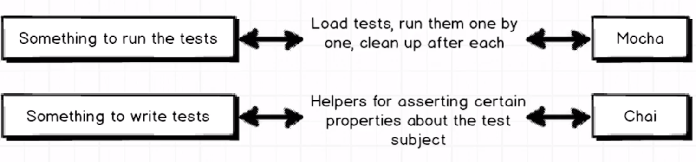

### Testing example

### Tech stack:
- Mocha
- Chai http://chaijs.com/api/bdd/
- jsdom
- chai-jquery https://github.com/chaijs/chai-jquery

### Purpose of Mocha and Chai



### Testing set up helper (explanation)

  WIP

### How to run this repo:
- clone this repo
- ```npm install```
- ```npm run test:watch``` or just ```npm run test```
