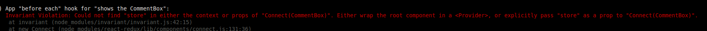

### Testing example

### Tech stack:
- Mocha
- Chai http://chaijs.com/api/bdd/
- jsdom
- chai-jquery https://github.com/chaijs/chai-jquery

### Purpose of Mocha and Chai


### Testing set up helper (explanation)

What is the purpose of test_helper?

- set up testing environment to run like a browser in the command line
  - ```jsdom``` library fakes html and DOM in the terminal
  Thanks to jsdom we have ```global``` obj which can act like a ```window``` obj in the browser
  **Set up fake browser in the terminal:**

  ```js
  import jsdom from 'jsdom';

  global.document = jsdom.jsdom('<!doctype html><html><body></body></html>')
  global.window = global.document.defaultView;
  //give jquery access to window object
  import _$ from 'jquery';
  //set up our own instance of jquery and have access to our fake DOM
  const $ = _$(global.window);
  ```
- build 'renderComponent' helper that should render a given react class

  - we will use the react test helper https://facebook.github.io/react/docs/test-utils.html#renderintodocument
  ```js
  import TestUtils from 'react-addons-test-utils';
  import ReactDOM from 'react-dom';

  function renderComponent(ComponentClass) {
    const componentInstance = TestUtils.renderIntoDocument(<ComponentClass />);
    // get access to DOM Node Element (html that Component produces)
    return $(ReactDOM.findDOMNode(componentInstance)); //now we have access to html via Jquery
  }

  ```
  - if you see this error:
  

  ```js
  // to render connected component we must wrap our component into provider component
  ...
  import { Provider } from 'react-redux';
  import { createStore } from 'redux';
  import reducers from '../src/reducers';

  // refactor above function
  function renderComponent(ComponentClass) {
    const componentInstance = TestUtils.renderIntoDocument(
      <Provider store={createStore(reducers)}>
        <ComponentClass />
      </Provider>
    );
    return $(ReactDOM.findDOMNode(componentInstance));
  }
  ```
  In our test we also use: ```component = renderComponent(CommentList, null, state);``` - we pass props or initial state from store into the component in the renderComponent function
  Refactor above function:

  ```js
  function renderComponent(ComponentClass, props, state) {
    const componentInstance = TestUtils.renderIntoDocument(
      <Provider store={createStore(reducers, state)}>
        <ComponentClass {...props} />
      </Provider>
    );
    return $(ReactDOM.findDOMNode(componentInstance));
  }

  ```
- build helper for simulating events

  Add simulate function to every jquery instance to be able to use it like:
  ```$('div').simulate()```

  ```js
  $.fn.simulate = function(eventName, value) {
    if (value) {
      this.val(value);
    }
    TestUtils.Simulate[eventName](this[0]); //this is reference to our target element
  }
  ```
  Reference https://facebook.github.io/react/docs/test-utils.html#simulate
- set up chai-jquery

  ```js
  import chaiJquery from 'chai-jquery';
  import chai from 'chai';

  //check chai docs
  chaiJquery(chai, chai.util, $);
  ```

### How to run this repo:
- clone this repo
- ```npm install```
- ```npm run test:watch``` or just ```npm run test```
